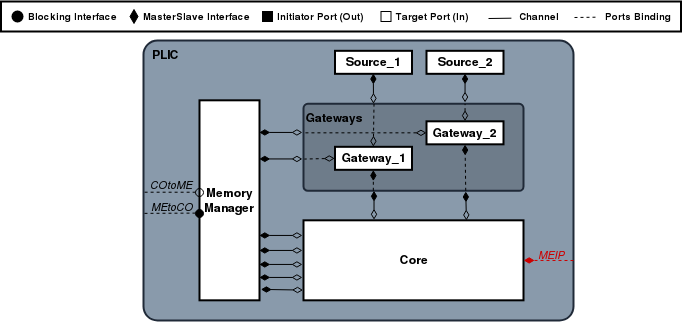

This README gives an overview of the structure of the Platform-Level Interrupt Controller (PLIC) and how to attach an interrupt source to it. For further reading refer
to the **riscv-privileged-v1.10** document.

Following the rules of SystemC-PPA (more details can be found [here](https://github.com/ludwig247/DeSCAM)) we created our Electronic System Level (ESL) of PLIC design as shown in following figure. We will briefly describe the modules and sub-modules created for this design and the communication channels used between them.

*"Global interrupt sources can take many forms, including level-triggered, edge-triggered, and message-signalled.
Some sources might queue up a number of interrupt requests. All global interrupt sources are converted to a common interrupt request format for the PLIC."*

For every form of interrupt source the designer should implement a compatible Gateway module that will translate the interrupt sensitivity to a SystemC-PPA format
**master_out<bool>** in order to link it properly with the PLIC_Core.

### Global Interrupt Sources:

In our current work we design a simple interrupt source that generate random interrupts using SCV.
This implementation can be found in *PLIC_source.h*

It has the following communication ports:
- **master_out<bool> IntSig**

### PLIC_Gateway:

Transfers an interrupt from source with to the PLIC_Core. It has the following communication ports:

- **slave_in<bool> IntSig** represents the incoming interrupt from the external source.
- **master_out<bool> IntReq** represents the forward interrupt request to the PLIC_Core.
- **slave_in<bool> fromMemoryPending** serves as an indicator from the MemoryManager that an interrupt from this source has been claimed and the gateway is allowed to forward a new interrupt request to the PLIC_Core 

### PLIC_Gateways:

This module acts as a *"TOP"* for the used gateways and their attached interrupt sources.

When a new interrupt source needs to be added, the designer should include in this module the interrupt source and it's suitable gateway.

**NOTE:** At the moment the PLIC does not support the possibility to connect an interrupt source that is situated outside the PLIC bounds because of lack of interrupt
sources.

### PLIC_Core:

This module handles the processing and prioritization of interrupts. It has the following communication ports:

- **slave_in<bool> fromGateway_Int1** represents the incoming interrupt request for the interrupt gateway.
- **slave_in<bool> fromGateway_Int2**
- **shared_in<unsigned int> fromMemory_Priority_Int_1** represent the assigned priority level to the interrupt source as stated by the user (i.e. running program). Which is forwarded through the MemoryManager.   
- **shared_in<unsigned int> fromMemory_Priority_Int_2**  
- **shared_in<unsigned int> fromMemory_Enabled**
- **shared_in<unsigned int> fromMemory_Threshold**
- **slave_in<unsigned int> fromMemory_Claimed**
- **shared_out<unsigned int> toMemory_MaxID**
- **slave_out<bool> MEIP_port** represents the final external interrupt status whish is forwarded to the MIP module.

When a new interrupt source is added, the designer should include in this module the required signals for handling it and add the processing part of this interrupt to the main thread, keeping in mind the respectful order of processing the interrupts.

### PLIC_MemoryManager:

This module manages the read and write commands to the PLIC module and forward the read/written registers values to the right sub-module.  It has the following communication ports:

- **blocking_in<CUtoME_IF> COtoME_port** used for reading memory access requests from the Core.
- **blocking_out<MEtoCU_IF> MEtoCO_port** used for presenting the PLIC memory reply to the Core.
- **shared_out<unsigned int> toCore_Priority_Int_1**
- **shared_out<unsigned int> toCore_Priority_Int_2**
- **shared_out<unsigned int> toCore_Enabled**
- **shared_out<unsigned int> toCore_Threshold**
- **master_out<unsigned int> toCore_Claimed**
- **shared_in<unsigned int> fromCore_MaxID**
- **master_out<bool> toGatewayPending_1**
- **master_out<bool> toGatewayPending_2**

# Example:

### Prerequisites
- In order to generated elf or hex programs for an example you need to have a functioning RISCV compiler.
For more details about this look at the RISCV Compiler section.
- To make sure no mixing happens while generating the programs, add to your .bashrc file the following lines:

        export RISCV_XLEN=32
        export RISCV_LIB=elf
        export RISCV=/opt/riscv32i

- In order to run elf programs on this processor you need to have Boost library installed.

### Externals:

You can find this example at ($SCAM/example/RISCV_interrupts/Examples/).

This example has been constructed to test the functionality of the interrupt handling and interrupt triggering for external interrupt sources connected to PLIC.
Only external, timer and software interrupt has been enabled in this example.

*main.c* shows how to register an interrupt handler for each external interrupt source, with a maximum number of external interrupt source of 32.
The external interrupt is activated when a value larger than zeor is given to the *PLIC_Interrupt_Enables* register.
Each interrupt handler should include an assignment to the matching interrupt pending address as an indicator of interrupt completion in order to allow its gateway to
forward further interrupt requests.

        *(PLIC_Pending_ADDR_REGISTER + irq_id - 1) = 0;

